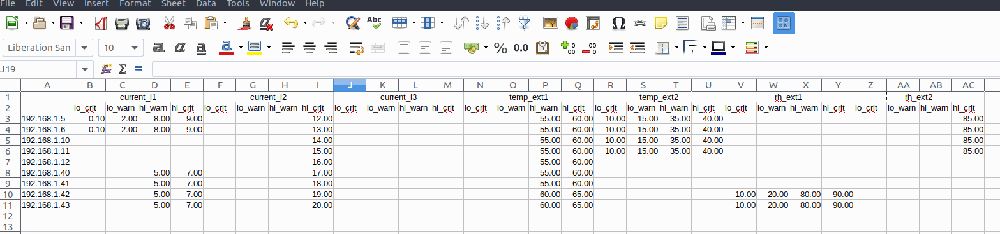

==================================
Riedo Networks Ltd Field utilities
==================================

This repository contains scripts and other tools that can be used on Riedo Networks's E3METER product line. It contains the following utilities:

- ``scripts/mass_upgrade.sh``: upgrade IPS devices in mass
- ``scripts/mass_configure.sh``: Execute commands on IPS devices in mass
- ``scripts/mass_configure_alarm.sh``: Configure IPS devices SNMP trap alarms in mass
  
For detailed description see bellow.

scripts/mass_upgrade.sh
=========================

This script has can do mass upgrade of IPS devices or display firmware version. 
For usage, use ``./mass_upgrade.sh --help``.

Example:
--------

Let's consider we have a file, called ``ip-list.txt`` which contains the  following text::

	192.168.1.54
	192.168.1.57
	192.168.1.97
	192.168.1.201
	192.168.1.2
				
On this list of IP addresses, 192.168.1.201 is a PC, 192.168.1.2 is not used and all other address are E3METER IPS devices.

The script can then be used as follow, showing version and other informations::

	$ ./mass_upgrade.sh -f ip-list.txt 
	Using IP list file ip-list.txt

	+------------------+--------+--------+-----------------+------------------+
	|    IP address    | Model  | Serial | Verion (build)  | Label            |
	+==================+========+========+=================+==================+
	|     192.168.1.54 | RN1212 | 001238 |  4.2 ( 43d5186) |          you |
	+------------------+--------+--------+-----------------+------------------+
	|     192.168.1.57 | RN1212 | 001236 |  4.2 ( 43d5186) |           Julian |
	+------------------+--------+--------+-----------------+------------------+
	|     192.168.1.97 | RN1212 | 001235 |  4.2 ( 43d5186) |            Nomad |
	+------------------+--------+--------+-----------------+------------------+
	|    192.168.1.201 | Not an IPS                                           |
	+------------------+--------+--------+-----------------+------------------+
	|      192.168.1.2 | Offline                                              |
	+------------------+--------+--------+-----------------+------------------+
	$

To upgrade the devices in the list, the user must provide the firmware file on the command line::

	$ ./mass_upgrade.sh -f ip-list.txt ips2_r4.2_43d5186_20170725.bin
	Using IP list file ip-list.txt
	Upgrade
	Upgrading using FW "/home/you/git/misc-tools/ips-field-tools/ips2_r4.2_43d5186_20170725.bin" which contains version 4.2.
	Transition FW : 
	Upgradeing IPS "you" at 192.168.1.54 from version 4.0 to 4.2...
	######################################################################## 100.0%
	Upgradeing IPS "Julian" at 192.168.1.57 from version 4.0 to 4.2...
	######################################################################## 100.0%
	Upgradeing IPS "Nomad" at 192.168.1.97 from version 4.0 to 4.2...
	######################################################################## 100.0%
	Device at 192.168.1.201 is not an IPS!
	Device at 192.168.1.2 seems to be offline!
	$

A range can be also specified. It that case, the script will "probe" all addresses in the range::

	$ ./mass_upgrade.sh -r 192.168.1.50 192.168.1.60 
	Using IP range 192.168.1.50 -> 192.168.1.60

	+------------------+--------+--------+-----------------+------------------+
	|    IP address    | Model  | Serial | Verion (build)  | Label            |
	+==================+========+========+=================+==================+
	|    192.168.01.54 | RN1212 | 001238 |  4.2 ( 43d5186) |          you |
	+------------------+--------+--------+-----------------+------------------+
	|    192.168.01.57 | RN1212 | 001236 |  4.2 ( 43d5186) |           Julian |
	+------------------+--------+--------+-----------------+------------------+
	$

For an upgrade (with range option)::

	$ ./mass_upgrade.sh -r 192.168.1.50 192.168.1.60 ips2_r4.0_3056_20170103.bin 
	Using IP range 192.168.1.50 -> 192.168.1.60
	Upgrade
	Upgrading using FW "/home/you/git/misc-tools/ips-field-tools/ips2_r4.0_3056_20170103.bin" which contains version 4.0.
	Transition FW : 
	192.168.01.54: Upgradeing IPS "Device1" at 192.168.01.54 from version 4.2 to 4.0...
	######################################################################## 100.0%
	192.168.01.57: Upgradeing IPS "Device 2" at 192.168.01.57 from version 4.2 to 4.0...
	######################################################################## 100.0%

scripts/mass_configure.sh
===========================

This script enable to send a command from the command line (the option value is passed "as is" to the IPS console") to an IP range or list like the "mass_upgrade.sh" script::

	$ ./mass_configure.sh -c "set snmp_trap_reciver 192.168.1.1" -c "set snmp_trap_community my_comunity" -f ip_list.txt
	$ ./mass_configure.sh -c "set snmp_trap_reciver 192.168.1.1+ -c "set snmp_trap_community" -r 192.168.1.10 192.168.1.35
	$ ./mass_configure.sh -c "set alarm current_l1 1.00 2.00 9. 10.0" -r 192.168.1.10 192.168.1.35

scripts/mass_configure_alarm.sh
=================================

Do a batch/mass alarm configuration. IPS devices are accessed trough TCP/IP/Ethernet. IPS devices are referenced by they IP addresses. 

The script uses CSV file as it is easy to process and we could use a tabulator to set it up. For example, this could be a template:

IP address in the first column, then the content is given by the header. If a column is missing, then it is not set. So the user can simply delete the column he don't want to set. Empty cell means no alarm configured. 

This view can be exported from Excel, Open-office as CSV as follow::

	,current_l1,current_l1,current_l1,current_l1,current_l2,current_l2,current_l2,current_l2,current_l3,current_l3,current_l3,current_l3,temp_ext1,temp_ext1,temp_ext1,temp_ext1,temp_ext2,temp_ext2,temp_ext2,temp_ext2,rh_ext1,rh_ext1,rh_ext1,rh_ext1,rh_ext2,rh_ext2,rh_ext2,rh_ext2
	,lo_crit,lo_warn,hi_warn,hi_crit,lo_crit,lo_warn,hi_warn,hi_crit,lo_crit,lo_warn,hi_warn,hi_crit,lo_crit,lo_warn,hi_warn,hi_crit,lo_crit,lo_warn,hi_warn,hi_crit,lo_crit,lo_warn,hi_warn,hi_crit,lo_crit,lo_warn,hi_warn,hi_crit
	192.168.1.5,0.10,2.00,8.00,9.00,,,,12.00,,,,,,,55.00,60.00,10.00,15.00,35.00,40.00,,,,,,,,85.00
	192.168.1.6,0.10,2.00,8.00,9.00,,,,13.00,,,,,,,55.00,60.00,10.00,15.00,35.00,40.00,,,,,,,,85.00
	192.168.1.10,,,,,,,,14.00,,,,,,,55.00,60.00,10.00,15.00,35.00,40.00,,,,,,,,85.00
	192.168.1.11,,,,,,,,15.00,,,,,,,55.00,60.00,10.00,15.00,35.00,40.00,,,,,,,,85.00
	192.168.1.12,,,,,,,,16.00,,,,,,,55.00,60.00,,,,,,,,,,,,
	192.168.1.40,,,5.00,7.00,,,,17.00,,,,,,,55.00,60.00,,,,,,,,,,,,
	192.168.1.41,,,5.00,7.00,,,,18.00,,,,,,,55.00,60.00,,,,,,,,,,,,
	192.168.1.42,,,5.00,7.00,,,,19.00,,,,,,,60.00,65.00,,,,,10.00,20.00,80.00,90.00,,,,
	192.168.1.43,,,5.00,7.00,,,,20.00,,,,,,,60.00,65.00,,,,,10.00,20.00,80.00,90.00,,,,

Each line  is for each PDU. If the first element is empty, then this is a header. First element of the line is the IP. If the first column is empty the line is discarded. The two first lines must contains headers. The first line contains the channel name. The second line contains the alarm level to set. Every other cell contains alarm configuration value that is matched to its line or column. The line gives the address (first column) and the column gives the channel and alarm name. Alarm level are real number with maximum two decimal places.

**Example**::

	$ ./mass_configure_alarm.sh my_alarm_configuration.csv 
	Configuring 192.168.1.57...Done
	Configuring 192.168.1.71...Done
	Configuring 192.168.1.76...Done
	Configuring 192.168.1.97...Done
